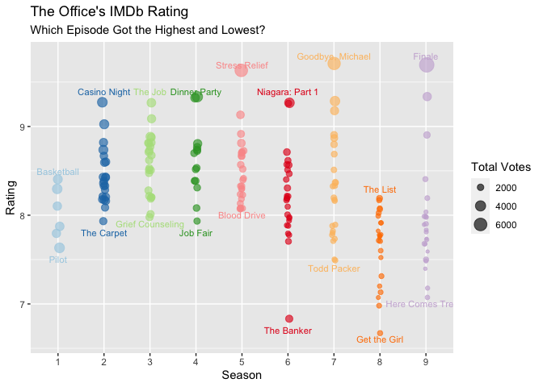
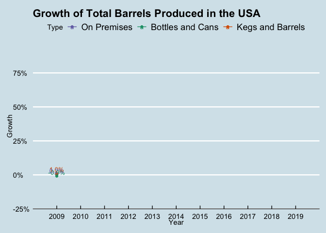
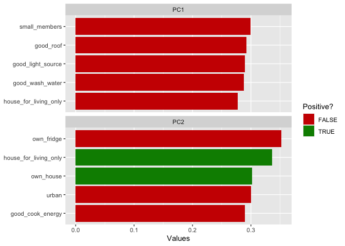
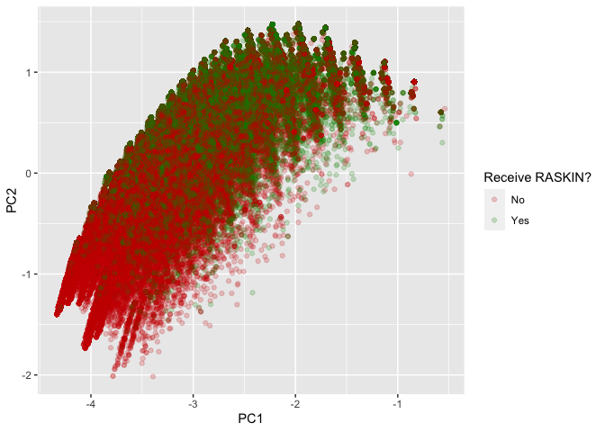

Rinorsa’s Portofolio
================

These are my latest simple data analysis on three different subjects.
The first two graphs were made as the submission of TidyTuesday, a
weekly RStudio data visualization project on Twitter.

## The Office’s IMDb Rating

The first one is IMDb Rating of The Office tv show. At a glance, we can
show that the rating and total vote for the latest season is relatively
lower than the previous (except for the finale).

<!-- -->

## USA Beer Production

The second one is a simpler graphic that shows production growth of beer
over the year in the USA.

<!-- -->

## Indonesia RASKIN Program (rice for the poor): a PCA Analysis

The last one is the more complex version where I use a Principal
Component Analysis Technique to get a sense of the distribution of
RASKIN program. Detailed analysis can bee seen in
<https://github.com/derinorsaa/RASKIN/blob/master/PCA.md>. Wealthier
characteristics are to the left and poorer characteristics are to the
right (second image). Households that have ever received RASKIN tend to
be on the right side of the x-axis. RASKIN is indeed distributed to poor
households, but it is far from perfect.

<!-- -->
<!-- -->

My analysis gives a limited suggestion that while the selection process
of RASKIN needs to be improved (some wealthier households also enjoy
RASKIN), the fact that some poorer households never received RASKIN
means that the information of this program also has to be promoted more
widely and more inclusive.
